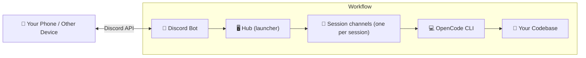

# remote-opencode

> Control your AI coding assistant from anywhere — your phone, tablet, or another computer.

 📦 Used by developers worldwide — **2,000+ weekly downloads** on npm

<div align="center">

</div>

> 🆕 **New in v1.6!** **Hub** with buttons, **one Discord channel per session** named after the session, sticky action buttons (Plan/Build, Interrupt, Diff, Model, Archive), resume your existing OpenCode sessions directly in Discord, and **voice transcription powered by the local Handy app**.
>
> 🧵 **v1.5:** Session management — browse, attach, and manage OpenCode CLI sessions from Discord with `/session`.
>
> 🎤 **v1.4:** Voice message support — send voice messages that are automatically transcribed and processed.

**remote-opencode** is a Discord bot that bridges your local [OpenCode CLI](https://github.com/sst/opencode) to Discord, enabling you to interact with your AI coding assistant remotely. Perfect for developers who want to:

- 📱 **Code from mobile** — Send coding tasks from your phone while away from your desk
- 💻 **Access from any device** — Use your powerful dev machine from a laptop or tablet
- 🌍 **Work remotely** — Control your home/office workstation from anywhere
- 🎛️ **Console-like UX** — A hub to launch sessions, one channel per session, and buttons for everything (no slash-command typing on your phone)
- 👥 **Collaborate** — Share AI coding sessions with team members in Discord
- 🤖 **Automated Workflows** — Queue up multiple tasks and let the bot process them sequentially
- 🎤 **Voice Messages** — Send voice messages that are transcribed locally by **Handy** and processed as text

## How It Works



The bot runs on your development machine alongside OpenCode. You launch sessions from a hub channel, each session gets its own text channel named after the session, and the output streams back in real-time.

## Demo

https://github.com/user-attachments/assets/b6239cb6-234e-41e2-a4d1-d4dd3e86c7b9

### 🎤 Voice Mode Demo

https://github.com/user-attachments/assets/59cf162a-ec86-41b5-a1f3-9b1379acd9fd

---

## Table of Contents

- [Installation](#installation)
- [Quick Start](#quick-start)
- [Hub & Session Channels](#hub--session-channels)
- [Discord Bot Setup](#discord-bot-setup)
- [Voice Transcription (Handy)](#voice-transcription-handy)
- [CLI Commands](#cli-commands)
- [Discord Slash Commands](#discord-slash-commands)
- [Usage Workflow](#usage-workflow)
- [Access Control](#access-control)
- [Configuration](#configuration)
- [Run as a systemd service](#run-as-a-systemd-service)
- [Proxy Support](#proxy-support)
- [Troubleshooting](#troubleshooting)
- [Development](#development)
- [Changelog](#changelog)
- [License](#license)

---

## Installation

### Prerequisites

- **Node.js 22+** — [Download](https://nodejs.org/)
- **Build tools** — `node-pty` compiles from source on install (`build-essential` + `python3` on Debian/Ubuntu)
- **OpenCode CLI** — Must be installed and working on your machine
- **Discord Account** — With a server where you have admin permissions
- **Handy** *(optional, for voice)* — Local speech-to-text app, see [Voice Transcription (Handy)](#voice-transcription-handy)

### Install from source (recommended)

```bash
git clone https://github.com/Felipe-258/remote-opencode.git
cd remote-opencode
npm install
npm run build
npm link  # Makes 'remote-opencode' available globally
```

### Install via npm

```bash
# Global installation
npm install -g remote-opencode

# Or run directly with npx
npx remote-opencode
```

> **Note:** The npm package is the upstream build and does **not** include the v1.6 hub / session-channel features. Use the source install above (or the fork) for the latest features.

---

## Quick Start

```bash
# Step 1: Run the interactive setup wizard
remote-opencode setup

# Step 2: Start the Discord bot
remote-opencode start
```

Then, in your Discord server:

1. Run `/hub` in any text channel — this becomes your **launcher**.
2. Press **🆕 Nueva sesión**, type a name (e.g. `24 august`), and a session channel `🤖 24 august` is created.
3. Type your prompt directly in that channel — it goes straight to OpenCode.

---

## Hub & Session Channels

The v1.6 UX is built around a **hub** and **one Discord channel per session**, so you almost never need to type slash commands from your phone.

### The Hub

Run `/hub` in any text channel. The bot pins a launcher panel with buttons:

| Button | Action |
|---|---|
| 🆕 **Nueva sesión** | Opens a modal where you name the session, then creates a session channel |
| 📋 **Sesiones** | Lists your sessions (including existing OpenCode sessions) and lets you resume or reopen them |
| 🧠 **Modelo** | Sets the default model used for new sessions |
| 📂 **Proyecto** | Sets the default project used for new sessions |

The hub remembers its project alias, model, and category. By default the model is `deepseek/deepseek-v4-flash` (set per project with the **🧠 Modelo** button).

### Session channels

When you create a session:

- A text channel `🤖 <name>` is created inside a **Sesiones** category (created automatically).
- The channel is bound to the hub's project and model.
- A matching OpenCode session is created **with that title**.
- **Passthrough is ON**: any message you type in the channel is sent directly to OpenCode.
- A pinned message shows sticky buttons:

| Button | Action |
|---|---|
| 🎯 **Plan / 🔨 Build** | Toggle agent mode (like `Tab` in the TUI) |
| ⏹️ **Interrupt** | Abort the current task |
| 📊 **Diff** | Show `git diff` of the project |
| 🧠 **Modelo** | Change the model for this channel |
| 🗑 **Archivar** | Archive the session (channel becomes `🔒 <name>` and is hidden) |
| ↩️ **Undo** | Revert the last user message |
| ℹ️ **Status** | Project, branch, model, mode, session and busy state |
| 🧹 **Compactar** | Summarize/compact the context |
| ⚡ **Init** | Generate/update `AGENTS.md` for the project |

If OpenCode renames the session (it auto-titles sessions after the first reply), the channel is renamed to match.

### Sessions list & resume

**📋 Sesiones** shows, sorted by most recent activity:

- Sessions already mapped to Discord channels (🟢 active / ⚪ idle, 🔒 archived).
- **Other sessions from OpenCode** — including ones you created earlier in the terminal. Use the **"Resumir sesión en Discord"** select to create a channel attached to an existing OpenCode session and continue the conversation.
- **Archived sessions** — reopen any archived session (channel becomes visible again and passthrough is restored).

---

## Discord Bot Setup

The setup wizard (`remote-opencode setup`) guides you through the entire process interactively:

1. **Opens Discord Developer Portal** in your browser
2. **Walks you through** creating an application, enabling intents, and getting your bot token
3. **Generates the invite link** automatically and opens it in your browser
4. **Deploys slash commands** to your server

Just run `remote-opencode setup` and follow the prompts — no manual URL copying needed!

<details>
<summary>📖 Manual setup reference (click to expand)</summary>

1. **Create Application**: Go to [Discord Developer Portal](https://discord.com/developers/applications), create a new application
2. **Enable Intents**: In "Bot" section, enable SERVER MEMBERS INTENT and MESSAGE CONTENT INTENT
3. **Get Bot Token**: In "Bot" section, reset/view token and copy it
4. **Get Guild ID**: Enable Developer Mode in Discord settings, right-click your server → Copy Server ID
5. **Invite Bot**: The bot needs to **create channels, manage categories and hide channels**. Use this URL (permissions `275901456`):
   ```
   https://discord.com/api/oauth2/authorize?client_id=YOUR_CLIENT_ID&permissions=275901456&scope=bot+applications.commands
   ```
6. **Check Channel Access**: For private or restricted channels, make sure the bot user or bot role can access the channel.

</details>

### Required permissions

| Permission | Why |
|---|---|
| Manage Channels | Create the `Sesiones` category and session channels, hide archived ones |
| View Channel / Send Messages | Interact in channels and threads |
| Manage Messages | Edit streamed messages and pin the sticky panels |
| Embed Links / Read Message History | Render embeds and read the conversation |
| Create Public Threads / Send Messages in Threads | Legacy thread-based flows (`/work`, `/opencode` in a channel) |
| Attach Files | Voice/download flows |

---

## Voice Transcription (Handy)

Voice messages in session channels are transcribed **locally** using **Handy** — a speech-to-text desktop app (Whisper-family models via transcribe-cpp). No API keys, no cloud, audio never leaves your machine.

### How it works

1. You send a **voice message** (🎤) in a session channel.
2. The bot downloads it, converts it to 16 kHz mono WAV with a bundled `ffmpeg-static` binary (no system ffmpeg needed).
3. It runs `handy --transcribe-file <wav> --json` and sends the text as a prompt to OpenCode (queued if the agent is busy).

### Install Handy

```bash
sudo apt install handy
```

Open the Handy app, pick a model (e.g. Parakeet V3 or Nemotron Streaming) that handles your language well, and leave it running (system tray). The bot uses the same model you selected in the app.

### Environment variables

| Variable | Default | Description |
|---|---|---|
| `HANDY_BIN` | `/usr/bin/handy` | Path to the Handy binary |
| `HANDY_MODEL` | *(Handy's selected model)* | Optional model id to force for transcription |
| `HANDY_TIMEOUT_MS` | `120000` | Max time for one transcription |

`/voice status` reports whether Handy was found.

> **Running under systemd:** Handy initializes GTK even in headless mode, so the service needs the graphical session environment: `DISPLAY`, `WAYLAND_DISPLAY` and `XDG_RUNTIME_DIR`. See [Run as a systemd service](#run-as-a-systemd-service).
>
> **Docker note:** Handy is a desktop app, so voice transcription is only supported when the bot runs natively on the same host. The bundled `ffmpeg-static` binary also targets glibc — the alpine-based `Dockerfile` is fine for the rest of the bot but not for voice.

---

## CLI Commands

| Command                                 | Description                                          |
| --------------------------------------- | ---------------------------------------------------- |
| `remote-opencode`                       | Start the bot (shows setup guide if not configured)  |
| `remote-opencode setup`                 | Interactive setup wizard — configures bot token, IDs |
| `remote-opencode start`                 | Start the Discord bot                                |
| `remote-opencode deploy`                | Deploy/update slash commands to Discord              |
| `remote-opencode undeploy`              | Remove slash commands from Discord                   |
| `remote-opencode config`                | Display current configuration info                   |
| `remote-opencode allow add <userId>`    | Add a Discord user ID to the allowlist               |
| `remote-opencode allow remove <userId>` | Remove a Discord user ID from the allowlist          |
| `remote-opencode allow list`            | List all user IDs in the allowlist                   |
| `remote-opencode allow reset`           | Clear the entire allowlist (removes access control)  |
| `remote-opencode voice status`          | Show voice transcription status (Handy)              |

---

## Discord Slash Commands

Once the bot is running, use these commands in your Discord server:

### `/hub` — Set Up the Launcher

Make the current channel your hub. Pins the launcher panel (new session, sessions list, model, project).

```
/hub
```

---

### `/setpath` — Register a Project

Register a local project path with an alias for easy reference.

```
/setpath alias:myapp path:/Users/you/projects/my-app
```

| Parameter | Description                                           |
| --------- | ----------------------------------------------------- |
| `alias`   | Short name for the project (e.g., `myapp`, `backend`) |
| `path`    | Absolute path to the project on your machine          |

### `/projects` — List Registered Projects

View all registered project paths and their aliases.

```
/projects
```

### `/use` — Bind Project to Channel

Set which project a Discord channel should interact with.

```
/use alias:myapp
```

After binding, all `/opencode` commands in that channel will work on the specified project.

### `/opencode` — Send Command to AI

Sends a prompt to OpenCode and streams the response.

```
/opencode prompt:Add a dark mode toggle to the settings page
```

**Behavior in v1.6:**

- In a **session channel** → runs the prompt in that session.
- In the **hub** (or any non-session channel) → creates a session channel named after the prompt and runs it there.
- **Legacy:** in a thread, it continues the thread's conversation.

**Features:**

- ⚡ **Real-time streaming** — see output as it's generated (1-second updates)
- ⏸️ **Interrupt button** — stop the current task if needed
- 📝 **Session persistence** — continue conversations in the same channel/thread

### `/work` — Create a Git Worktree

Start isolated work on a new branch with its own worktree.

```
/work branch:feature/dark-mode description:Implement dark mode toggle
/work branch:feature/dark-mode      # description defaults to the branch name
```

| Parameter     | Description                                         |
| ------------- | --------------------------------------------------- |
| `branch`      | Git branch name (will be sanitized)                 |
| `description` | Optional. Defaults to the branch name when omitted. |

**Features:**

- 🌳 Creates a new git worktree for isolated work
- 🧵 Opens a dedicated thread for the task
- 🗑️ **Delete button** — removes worktree and archives thread
- 🚀 **Create PR button** — automatically creates a pull request

### `/code` — Toggle Passthrough Mode

Enable passthrough mode to send messages directly to OpenCode without slash commands.

```
/code
```

**How it works:**

1. Run `/code` in a session channel (or a thread) to enable passthrough mode
2. Type messages naturally — they're sent directly to OpenCode
3. Run `/code` again to disable

> Session channels created from the hub have passthrough **already enabled** — no need to run `/code`.

**Features:**

- 📱 **Mobile-friendly** — no more typing slash commands on phone
- ⏳ **Busy indicator** — shows 📥 reaction and queues if the previous task is still running
- 🔒 **Safe** — ignores bot messages (no infinite loops)

### `/autowork` — Toggle Automatic Worktree Creation

Enable automatic worktree creation for a project. When enabled, new `/opencode` sessions will automatically create isolated git worktrees.

```
/autowork
```

### `/autocode` — Toggle Automatic Passthrough Mode

Enable automatic passthrough mode for a project. When enabled, every new thread the bot creates will already have passthrough mode on.

```
/autocode
```

### `/queue` — Manage Message Queue

Control the automated job queue for the current channel/thread.

```
/queue list
/queue clear
/queue pause
/queue resume
/queue settings continue_on_failure:True fresh_context:False
```

**Settings:**

- `continue_on_failure`: If `True`, the bot moves to the next task even if the current one fails.
- `fresh_context`: If `True`, the AI forgets previous chat history for each new queued task. Default: `False`.

### `/diff` — View Git Diff

Show git diffs for the current project directly in Discord — perfect for reviewing AI-made changes from your phone.

```
/diff
/diff target:staged
/diff target:branch base:develop
/diff stat:true
```

| Parameter | Description                                                        |
| --------- | ------------------------------------------------------------------ |
| `target`  | `unstaged` (default), `staged`, or `branch`                        |
| `stat`    | Show `--stat` summary only instead of full diff (default: `false`) |
| `base`    | Base branch for `target:branch` diff (default: `main`)             |

### `/allow` — Manage Allowlist

Manage the user allowlist directly from Discord. This command is only available when the allowlist has already been initialized (at least one user exists).

```
/allow action:add user:@username
/allow action:remove user:@username
/allow action:list
```

### `/voice` — Voice Transcription Status

```
/voice status
```

Shows whether Handy is available and transcription is enabled.

### `/model` — List & Set AI Model

View available AI models or set the model for the current channel.

```
/model list
/model set name:anthropic/claude-sonnet-4-20250514
```

| Subcommand | Description                                     |
| ---------- | ----------------------------------------------- |
| `list`     | Show all available models grouped by provider   |
| `set`      | Set the AI model for the current channel/thread |

**Features:**

- 🔍 **Autocomplete** — start typing a model name and get instant suggestions
- 💾 **Per-channel persistence** — model preferences are saved per channel/thread

### `/session` — Browse & Manage Sessions

Browse OpenCode CLI sessions and manage session-channel mappings. Useful for resuming previous conversations or sharing sessions.

```
/session list
/session attach
/session detach
/session info
```

| Subcommand | Description                                                  |
| ---------- | ------------------------------------------------------------ |
| `list`     | List all sessions for the current project (active + mapped)  |
| `attach`   | Attach an existing session to this thread (interactive menu) |
| `detach`   | Disconnect the session from this thread                      |
| `info`     | Show detailed status of the attached session                 |

---

## Usage Workflow

### Hub Workflow (v1.6, recommended — mobile friendly)

1. **Set up the hub:**

   ```
   /hub
   ```

2. **Register and bind your project** (once):

   ```
   /setpath alias:webapp path:/home/user/my-webapp
   ```

   Then press **📂 Proyecto** in the hub and pick `webapp`.

3. **Create a session** — press **🆕 Nueva sesión**, type a name.
4. **Code** — type prompts directly in the new `🤖 <name>` channel. Use the sticky buttons for Interrupt, Diff, Model, Undo, Archive.
5. **Resume later** — press **📋 Sesiones** in the hub: pick an existing OpenCode session to resume it in Discord, or reopen an archived one.

### Mobile Workflow

1. 📱 Open Discord on your phone
2. Open the hub channel and press **🆕 Nueva sesión**
3. Type prompts directly in the session channel (passthrough is on)
4. Use buttons to Interrupt / Diff / Archive — no slash commands needed
5. Send **voice messages** (🎤) — they're transcribed locally by Handy and sent as prompts

### Team Collaboration Workflow

Share AI coding sessions with your team:

1. Create a dedicated Discord channel for your project
2. Bind the project: `/use alias:team-project`
3. Team members can watch sessions in real-time
4. Discuss in channels while AI works

> ⚠️ If the server has people you don't trust, configure the [allowlist](#access-control) first.

### Automated Iteration Workflow

Perfect for "setting and forgetting" several tasks:

1. **Send multiple instructions** — if the bot is busy, tasks are queued (📥).
2. The bot finishes the current task, then processes the queue in order.
3. **Monitor progress:** `/queue list`.

---

## Access Control

remote-opencode supports an optional **user allowlist** to restrict who can interact with the bot. This is essential when your bot runs in a shared Discord server where untrusted users could otherwise execute commands on your machine.

### How It Works

- **No allowlist configured (default):** All Discord users in the server can use the bot. This preserves backward compatibility for existing installations.
- **Allowlist configured (1+ user IDs):** Only users whose Discord IDs are in the allowlist can use slash commands, buttons, and passthrough messages. Unauthorized users receive a rejection message.

### Setting Up Access Control

> **⚠️ SECURITY WARNING: If your bot operates in a Discord channel accessible to untrusted users, you MUST configure the allowlist before starting the bot. The initial allowlist setup can ONLY be done via the CLI or the setup wizard — NOT from Discord. This prevents unauthorized users from adding themselves to an empty allowlist.**

#### Option 1: Setup Wizard (Recommended for first-time setup)

```bash
remote-opencode setup
```

Step 5 of the wizard prompts you to enter your Discord user ID. This becomes the first entry in the allowlist.

#### Option 2: CLI

```bash
# Add your Discord user ID
remote-opencode allow add 123456789012345678

# Verify
remote-opencode allow list
```

### Safety Guardrails

- **Cannot remove the last user** — prevents accidental lockout
- **`allow reset`** is the only way to fully clear the allowlist (intentional action)
- **Discord `/allow` is disabled when allowlist is empty** — prevents bootstrap attacks
- **Config file permissions** are set to `0o600` (owner-read/write only)

### OpenCode server password (optional)

If you run `opencode serve` with HTTP Basic auth enabled via `OPENCODE_SERVER_PASSWORD` (and optionally `OPENCODE_SERVER_USERNAME`), the bot picks up the same credentials and applies them to all internal communication — session HTTP calls, the SSE `/event` stream, and readiness probes.

```bash
OPENCODE_SERVER_PASSWORD='your-password' remote-opencode start
```

---

## Configuration

All configuration is stored in `~/.remote-opencode/`:

| File          | Purpose                                       |
| ------------- | --------------------------------------------- |
| `config.json` | Bot credentials (token, client ID, guild ID)  |
| `data.json`   | Projects, bindings, sessions, hub, archives   |

### config.json Structure

```json
{
  "discordToken": "your-bot-token",
  "clientId": "your-application-id",
  "guildId": "your-server-id",
  "allowedUserIds": ["123456789012345678"]
}
```

> `allowedUserIds` is optional. When omitted or empty, access control is disabled.

### data.json Structure

```json
{
  "projects": [
    { "alias": "myapp", "path": "/Users/you/projects/my-app" }
  ],
  "bindings": [
    { "channelId": "channel-id", "projectAlias": "myapp", "model": "deepseek/deepseek-v4-flash" }
  ],
  "threadSessions": [ ... ],
  "worktreeMappings": [ ... ],
  "hub": {
    "hubChannelId": "hub-channel-id",
    "categoryId": "sesiones-category-id",
    "projectAlias": "myapp",
    "model": "deepseek/deepseek-v4-flash",
    "agent": "build"
  },
  "channelAgents": [ { "channelId": "channel-id", "agent": "build" } ],
  "archivedSessions": [ ... ]
}
```

| Field            | Description                                                        |
| ---------------- | ------------------------------------------------------------------ |
| `hub`            | Hub channel, category, default project alias, model and agent mode |
| `channelAgents`  | Per-channel agent mode (`build` / `plan`)                          |
| `archivedSessions` | Archived session channels, ready to be reopened                  |

### Environment variables

| Variable | Description |
|---|---|
| `HANDY_BIN` | Path to the Handy binary (default `/usr/bin/handy`) |
| `HANDY_MODEL` | Force a Handy model id for transcription |
| `HANDY_TIMEOUT_MS` | Handy transcription timeout in ms (default `120000`) |
| `OPENCODE_SERVER_PASSWORD` | Optional HTTP Basic auth password for `opencode serve` |
| `OPENCODE_SERVER_USERNAME` | Optional auth username (default `opencode`) |
| `HTTP_PROXY` / `HTTPS_PROXY` / `ALL_PROXY` / `NO_PROXY` | Proxy support for outbound requests |

---

## Run as a systemd service

Run the bot in the background and start it on boot:

`/etc/systemd/system/remote-opencode.service`:

```ini
[Unit]
Description=remote-opencode Discord bot
After=network.target

[Service]
Type=simple
User=felipe
WorkingDirectory=/home/felipe/Documents/Github/remote-opencode
Environment=PATH=/home/felipe/.nvm/versions/node/v24.15.0/bin:/home/felipe/.opencode/bin:/usr/local/bin:/usr/bin:/bin
# Required so Handy can initialize GTK for local transcription
Environment=DISPLAY=:0
Environment=WAYLAND_DISPLAY=wayland-0
Environment=XDG_RUNTIME_DIR=/run/user/1000
ExecStart=/home/felipe/.nvm/versions/node/v24.15.0/bin/node --no-deprecation /home/felipe/Documents/Github/remote-opencode/dist/src/cli.js start
Restart=on-failure
RestartSec=5

[Install]
WantedBy=multi-user.target
```

```bash
sudo systemctl daemon-reload
sudo systemctl enable --now remote-opencode
sudo journalctl -u remote-opencode -f
```

Adjust the paths, user and display variables to your environment. If you don't use voice, the `DISPLAY`/`WAYLAND_DISPLAY`/`XDG_RUNTIME_DIR` lines can be omitted.

---

## Proxy Support

`remote-opencode` supports HTTP proxy environments for Discord and other external API requests via `HTTP_PROXY`, `HTTPS_PROXY`, `ALL_PROXY`, and `NO_PROXY`. Local OpenCode traffic is always kept direct (`localhost`, `127.0.0.1`, `::1` are excluded automatically).

---

## Troubleshooting

### Bot doesn't respond to commands

1. **Check bot is online:** Look for the bot in your server's member list
2. **Verify permissions:** the bot needs Manage Channels, Send Messages, Manage Messages, Embed Links, Read Message History, and (for legacy flows) Create Public Threads
3. **Redeploy commands:**
   ```bash
   remote-opencode deploy
   ```

### Voice transcription fails with "Failed to initialize GTK"

Handy needs a display server even in headless mode. When running under systemd, add the graphical session environment to the unit:

```ini
Environment=DISPLAY=:0
Environment=WAYLAND_DISPLAY=wayland-0
Environment=XDG_RUNTIME_DIR=/run/user/1000
```

Then restart the service.

### "No project set for this channel"

Bind a project first:

```
/setpath alias:myproject path:/path/to/project
/use alias:myproject
```

Or set the default project from the hub with **📂 Proyecto**.

### "Cannot create thread" / session channel not created

Make sure the bot has **Manage Channels** and can access the channel/category.

### Commands not appearing in Discord

1. Kick the bot from your server
2. Re-invite it with the invite URL above
3. Run `remote-opencode deploy`

### OpenCode server errors

1. **Verify OpenCode is installed:**
   ```bash
   opencode --version
   ```
2. **Check if another process is using the port**
3. **Ensure the project path exists and is accessible**

### Bot crashes on startup

1. **Check Node.js version:**
   ```bash
   node --version  # Should be 22+
   ```
2. **Verify configuration:** `remote-opencode config`
3. **Re-run setup:** `remote-opencode setup`

---

## Development

### Run from source

```bash
git clone https://github.com/Felipe-258/remote-opencode.git
cd remote-opencode
npm install

# Development mode (with ts-node)
npm run dev setup   # Run setup
npm run dev start   # Start bot

# Build and run production
npm run build
npm start
```

### Run tests

```bash
npm test
```

### Project Structure

```
src/
├── cli.ts                 # CLI entry point
├── bot.ts                 # Discord client initialization
├── commands/              # Slash command definitions
│   ├── hub.ts             # Hub / launcher panel with buttons
│   ├── opencode.ts        # Main AI interaction command
│   ├── code.ts            # Passthrough mode toggle
│   ├── work.ts            # Worktree management
│   ├── diff.ts            # Git diff viewer
│   ├── model.ts           # AI model list/set with autocomplete
│   ├── session.ts         # Session browsing and management
│   ├── allow.ts           # Allowlist management
│   ├── voice.ts           # Voice transcription status
│   ├── setpath.ts         # Project registration
│   ├── projects.ts        # List projects
│   └── use.ts             # Channel binding
├── handlers/              # Interaction handlers
│   ├── interactionHandler.ts  # Commands, modals, select menus
│   ├── buttonHandler.ts       # Buttons (sticky panels, hub)
│   └── messageHandler.ts      # Passthrough + voice message handling
├── services/              # Core business logic
│   ├── serveManager.ts    # OpenCode process management
│   ├── sessionManager.ts  # Session state management
│   ├── sessionFlow.ts     # Session channels, sticky messages, archive/reopen
│   ├── queueManager.ts    # Automated job queuing (incl. voice)
│   ├── executionService.ts # Core prompt execution logic
│   ├── voiceService.ts    # Voice transcription (Handy local)
│   ├── sseClient.ts       # Real-time event streaming
│   ├── dataStore.ts       # Persistent storage
│   ├── configStore.ts     # Bot configuration
│   └── worktreeManager.ts # Git worktree operations
├── setup/                 # Setup wizard
│   ├── wizard.ts
│   └── deploy.ts
└── utils/                 # Utilities
    ├── messageFormatter.ts
    └── threadHelper.ts
```

---

## Changelog

See [CHANGELOG.md](CHANGELOG.md) for a full history of changes.

---

## License

MIT

---

## Contributing

Contributions are welcome! Please read our [Contributing Guide](CONTRIBUTING.md) before submitting a Pull Request.
